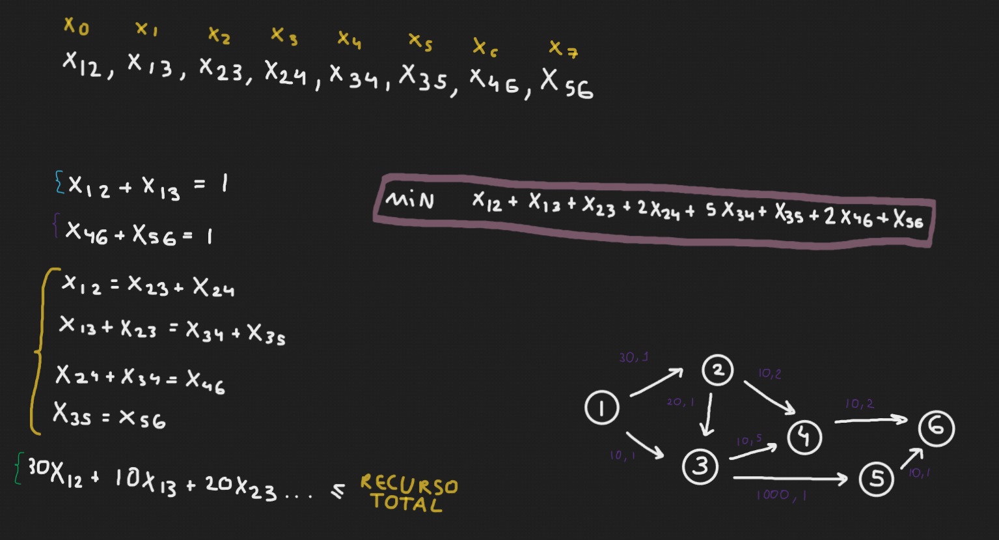
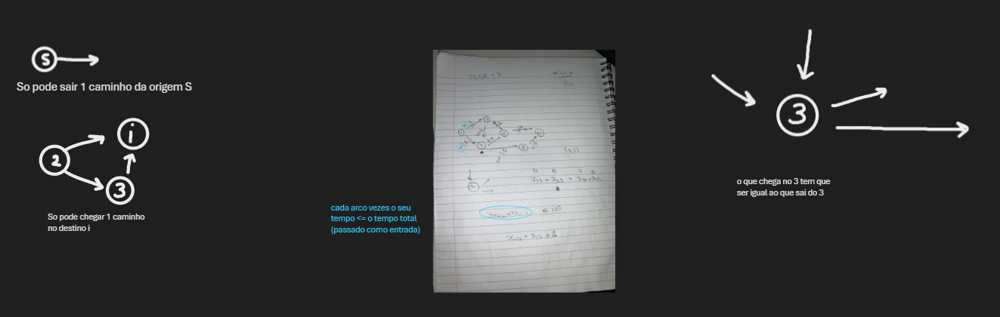

# Resource Constrained Shortest Path Problem

Problema de otimização em que se busca encontrar o caminho mais curto em um grafo direcionado, considerando não apenas os custos associados às arestas, mas também restrições de recursos específicos ao longo do caminho

## Objetivo:

Implementar um modelo genérico de Programação Linear Inteira para resolver o Problema do Caminho Mais Curto com Restrição de Recursos

## Pré-requisito:

- IDE + Java
- Biblioteca[ OR-Tools](https://drive.google.com/drive/folders/1p6Rv_-L9yC5mb95PGovguOaika1JlADH)

## Modelagem usada

